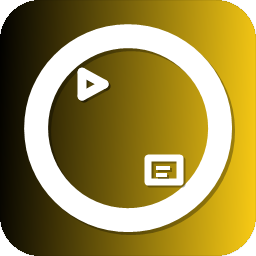

<p align="center">
  
</p>

<h1 align="center">oSlide2</h1>

<p align="center">
  Electron-based slide/presentation app — zero frameworks, vanilla JS
  <br/>
  <a href="#features">Features</a> ·
  <a href="#installation">Installation</a> ·
  <a href="#build">Build</a> ·
  <a href="#todo">TODO</a> ·
</p>

## Releases

See [GitHub Releases](https://github.com/not0kkinex/oSlide2/releases) for downloads and changelog.

### v0.2.0 (2026-05-27)

- **Editor redesign** — 5-group topbar, canvas ruler, zoom bar, AI FAB, status bar, panel tabs (Element/Slide/Animation), redesigned settings panel
- **Home screen redesign** — sidebar navigation, topbar search, 4-column card grid, list view, empty state
- **Light mode** — full light/dark theme support for both home and editor pages
- **Inno Setup installer** — dark-themed setup wizard with Turkish/English, custom bitmaps, gold accent (#FFD700)
- **Security fixes** — `renderMD()` XSS fix (href protocol whitelist), `--allow-file-access-from-files` removed, `structuredClone()` instead of `JSON.parse(JSON.stringify())`
- **Editor refactor** — split `editor.js` into `ai-ui.js` and `export.js`
- **i18n updates** — new home screen keys, version bumped in locale files
- **Zoom** — range 0.25–3, step 0.1, CSS transform scaling
- **Status bar** — save status dot (red/green), slide count, element count
- **Project filename** — displays actual project name in topbar

### v0.1.1 (2026-05-26)

- Simplified toolbar — removed non-functional icon buttons
- Updated app icon: black-to-yellow gradient, bold O letter with accents, rounded corners, drop shadows
- v0.1.1 portable EXE

### v0.1.0 (2026-05-26)

- Portable single-file EXE (self-signed) — no install required
- AI assistant, multi-select + alignment, animations, theme system
- i18n (Turkish/English), snap guides, presentation annotations, favorites

## Features

- **AI Assistant** — Generate slides, edit content, and execute commands via Pollinations.ai API
- **Multi-Select** — Shift+click to select multiple elements; align (left/center/right/top/middle/bottom), distribute (horizontal/vertical), match width/height
- **Animations** — Slide transitions (fade/slide/zoom), per-element entrance & emphasis effects, auto-stagger, "Apply to All"
- **Theme System** — Project themes with customizable colors, fonts, animations; theme picker with visual cards
- **Presentation Mode** — Fullscreen slideshow with pen and highlighter annotation tools
- **Snap Guides** — Visual alignment lines while dragging elements
- **Project Management** — Create, open, rename, duplicate, delete, favorite projects
- **DOM-Based Editor** — Add text, titles, images, rectangles, circles, arrows; properties panel
- **Slide Management** — Add, duplicate, delete, reorder via drag-and-drop thumbnails
- **Undo / Redo** — Unlimited history stack
- **Export / Import** — Export to PDF or PNG; import/export project files
- **Keyboard Shortcuts** — Fully customizable via Settings > Shortcuts
- **i18n** — Turkish & English localization (extensible)
- **Themes** — Dark, Light, and System with 3-card selector
- **Context Menu** — Right-click for project cards and editor elements
- **Dev Console** — Toggle with F12 for debugging
- **Auto-Save** — Periodic save to prevent data loss

## Built With

- [Electron](https://www.electronjs.org/) — Desktop framework
- [Lucide](https://lucide.dev/) — Icons
- [Inter](https://fonts.google.com/specimen/Inter) — UI font
- Vanilla JavaScript — No frameworks

## Installation

```bash
npm install
npm start
```

## Usage

1. Launch app — home screen appears
2. Click "New Project" or open an existing one
3. Use the toolbar to add and arrange elements
4. Press F5 for presentation mode
5. Press Ctrl+S to save

## Build

```bash
npm run build
```

Output: `dist/win-unpacked/oSlide2.exe` — Portable app (package with your own distributable)

## Project Structure

```
├── main.js                  # Electron main process
├── preload.js               # IPC bridge
├── home.html                # Home screen
├── editor.html              # Slide editor
├── presentation.html        # Presentation mode
├── css/
│   ├── home.css
│   ├── editor.css
│   └── presentation.css
├── js/
│   ├── core/
│   │   ├── state.js         # Application state, undo/redo
│   │   └── actions.js       # Slide and element CRUD
│   ├── ui/
│   │   ├── renderer.js      # DOM rendering
│   │   ├── canvas.js        # Canvas interactions (drag, resize)
│   │   └── panels.js        # Properties panel
│   ├── services/
│   │   ├── projectManager.js # Project CRUD
│   │   ├── fileManager.js   # File I/O
│   │   ├── shortcuts.js     # Customizable shortcuts
│   │   ├── i18n.js          # Localization
│   │   └── theme.js         # Theme management
│   ├── pages/
│   │   ├── home.js          # Home screen logic
│   │   ├── editor.js        # Editor logic
│   │   └── presentation.js  # Presentation logic
│   └── locales/
│       ├── tr.json          # Turkish translations
│       └── en.json          # English translations
└── package.json
```

## Keyboard Shortcuts

| Shortcut | Action |
|----------|--------|
| Ctrl+Z | Undo |
| Ctrl+Y | Redo |
| Ctrl+S | Save |
| Ctrl+C | Copy |
| Ctrl+V | Paste |
| Ctrl+B | Bold |
| Ctrl+I | Italic |
| Ctrl+U | Underline |
| Delete / Backspace | Delete selected |
| F5 | Start presentation |
| F12 | Toggle dev console |
| Escape | Close dialog/menu |

All shortcuts are customizable in Settings > Shortcuts.

## Contributors

<a href="https://github.com/not0kkinex/oSlide2/graphs/contributors">
  
</a>

## TODO

- [x] Slide templates & layouts
- [ ] Charts & data visualization
- [ ] Cloud sync / backup
- [ ] Collaborative editing
- [ ] Mobile remote control
- [ ] Plugin / extension system
- [ ] Video export (MP4/WebM)
- [ ] Custom themes marketplace
- [ ] PDF import
- [x] Undo/redo for element position changes during drag

